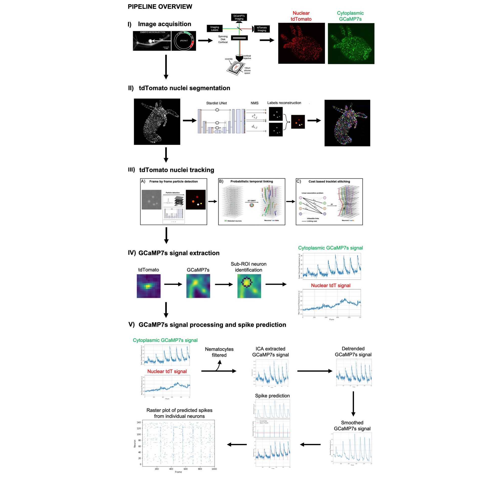

# TraSE-IN

Code of TraSE-IN paper: Automatic monitoring of whole-body neural activity in behaving Hydra.

The tracking code is published as a re-usable python library: [ByoTrack](https://github.com/raphaelreme/byotrack)



## Install

A more complete installation guide is provided in the [Install.md](https://github.com/raphaelreme/trase-in/blob/main/Install.md) file.

The installation requires [CaImAn](https://github.com/flatironinstitute/CaImAn) and [ByoTrack](https://github.com/raphaelreme/byotrack). These two requirements currently **impose to have python 3.10.**

We advise following their respective installation guidelines. Nonetheless we provide here an example of installation using *mamba* command (can be replaced by *conda* but it will be slower):

```bash
$ mamba create -n trasein -c conda-forge python==3.10 caiman
$ mamba activate trasein
$ pip install -r requirements.txt
```

In order to run the tracking pipeline, you also need to install [Icy](https://icy.bioimageanalysis.org/) software. Please follow their guidelines for installation.

## Getting started

The `main.ipynb` notebook runs the whole pipeline and provides visualization at different timesteps. Launch jupyter notebook and open the notebook to run the pipeline.

Jupyter-notebook can be launched from a terminal with:
```bash
$ conda activate trasein  # If not already done, activate your environment with conda/mamba
$ jupyter-notebook  # Launch a jupyter instance locally
```

Choose to run the `main.ipynb` notebook and execute it cell by cell.

The notebook requires 4 different paths to be set inside the cells:
- `gcamp_path`: path to the GCaMP video (for instance "path/to/data/doi_10_5061_dryad_h9w0vt4q3__v20230925/G7_contrxn-1.avi")
- `tdtomato_path`: path to the TdTomato video (for instance "path/to/data/doi_10_5061_dryad_h9w0vt4q3__v20230925/tdt_contrxn-1.avi")
- `model_path`: path to the trained stardist model (for instance "./stardist", if downloaded and unzipped in the current folder)
- `icy_path`: path to the main Icy jar (for instance "path/to/Icy/icy.jar")

## Model & Data

We have trained our own [StarDist](https://github.com/stardist/stardist) model in order to detect the neurons on each frame.
It can be downloaded from https://partage.imt.fr/index.php/s/npwHJHZebxqGMPi. We also provide a downloading script `download_model.sh`

To run detection with this stardist model in the `main.ipynb` notebook, you can simply change `model_path` value with the path to the `stardist` folder.

Example data will soon be available.


## Cite us

```bibtex
@article{hanson2023automatic,
  title={Automatic monitoring of whole-body neural activity in behaving Hydra},
  author={Hanson, Alison and Reme, Raphael and Telerman, Noah and Yamamoto, Wataru and Olivo-Marin, Jean-Christophe and Lagache, Thibault and Yuste, Rafael},
  journal={bioRxiv},
  pages={2023--09},
  year={2023},
  publisher={Cold Spring Harbor Laboratory}
}
```